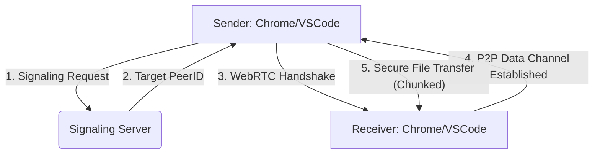

<div align="center">
  
  <h1>FileDrop</h1>
  <p><strong>Seamless, Secure, and Cross-Platform P2P File Sharing for Developers</strong></p>

  [](https://github.com/sRiSh-JaNa-tech/FileDrop)
  [](LICENSE)
  [](https://webrtc.org/)
  [](https://github.com/sRiSh-JaNa-tech/FileDrop)
</div>

---

## ⚡ Introduction

**FileDrop** is a high-performance, peer-to-peer (P2P) file and snippet sharing ecosystem designed specifically for modern developer workflows. By integrating directly into your browser and IDE, it eliminates the friction of cloud-based intermediaries, allowing for instantaneous transfers across local networks.

Built on the foundation of **WebRTC**, FileDrop ensures that your data stays private and your transfers stay fast.

### ✨ Key Highlights
- 🛡️ **Privacy by Design**: True P2P transfers. Your files never touch a cloud storage server.
- 🚀 **Extreme Low Latency**: Optimized chunking protocol for near-instant data streaming.
- 🔌 **Unified Workflow**: Share from Chrome to VS Code (and vice versa) without leaving your environment.
- 💎 **Minimalist UI**: A premium, distraction-free interface built for speed.

---

## 🏗️ Architecture & Core Logic

FileDrop utilizes a sophisticated hybrid model to ensure reliable connectivity and direct performance.



### Technical Specs
| Component | Technology | Role |
| :--- | :--- | :--- |
| **Signaling** | Node.js / Express / Redis | Facilitates peer discovery and handshake negotiation. |
| **Protocol** | WebRTC (DataChannel) | Secure, encrypted P2P binary data transport. |
| **Frontend** | Vanilla JS / CSS3 | High-performance, lightweight UI components. |
| **Storage** | Redis (Ephemeral) | In-memory mapping of friendly names to Peer IDs. |

---

## 📁 Repository Structure

```text
FileDrop/
├── ChromeExtension/       # Chrome-specific source & backend
│   ├── FileDrop/          # The browser extension
│   └── backend/           # Signaling server implementation
├── VScodeExtension/       # VS Code specific source
│   └── FileDrop/          # The IDE extension
├── assets/                # Brand assets and documentation images
└── Tests/                 # Automated test suites
```

---

## 🚀 Getting Started

### 📦 Chrome Extension
1. Open Chrome and navigate to `chrome://extensions/`.
2. Enable **Developer Mode** in the top right.
3. Click **Load Unpacked** and select the `ChromeExtension/FileDrop` directory.
4. Pin the extension for quick access!

### 💻 VS Code Extension
1. Clone the repository and navigate to `VScodeExtension/FileDrop`.
2. Run `npm install` to bootstrap dependencies.
3. Open the folder in VS Code and press `F5` to launch the extension host.

### 🌐 Signaling Server (Optional Local)
To run your own signaling server:
1. Navigate to `ChromeExtension/backend`.
2. Set up your `.env` (Redis URL).
3. Run `npm run dev`.

---

## 🛠️ Usage Workflow

1. **Identity**: Open FileDrop and set your unique identity (e.g., `sri-dev`).
2. **Connect**: Enter your peer's name in the connection field.
3. **Drop**: Drag and drop a file or click the transfer icon.
4. **Done**: Files are automatically received and saved with zero latency.

---

## 🔒 Security & Performance

FileDrop is built with developer productivity in mind.
- **End-to-End Encryption**: Inherits WebRTC's native DTLS encryption.
- **Intelligent Chunking**: Binary data is split into 24KB packets to optimize throughput and avoid buffer overflows.
- **Zero-Footprint**: Ephemeral connections ensure no data is left behind once the session ends.

---

<div align="center">
  <p>Built with ❤️ by the FileDrop Team</p>
  <a href="https://github.com/sRiSh-JaNa-tech/FileDrop">View on GitHub</a>
</div>
